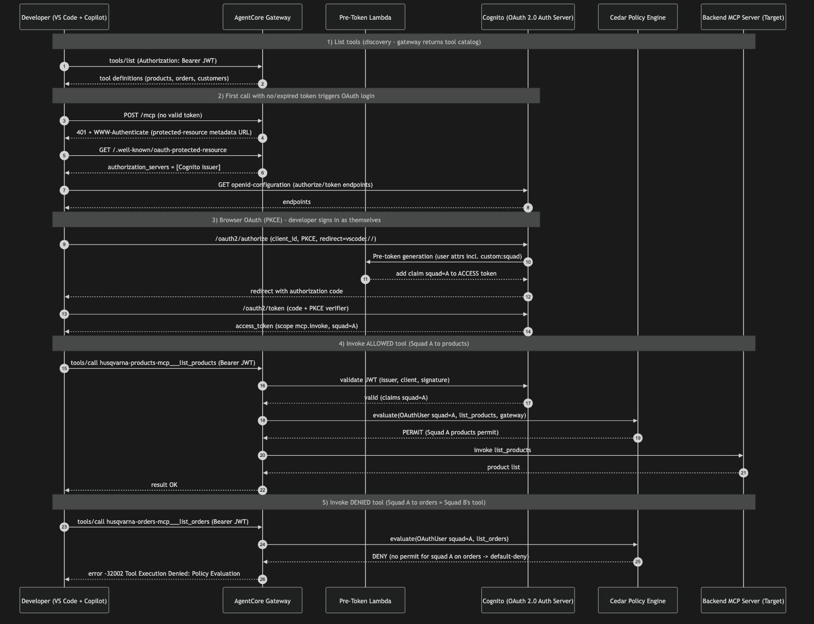
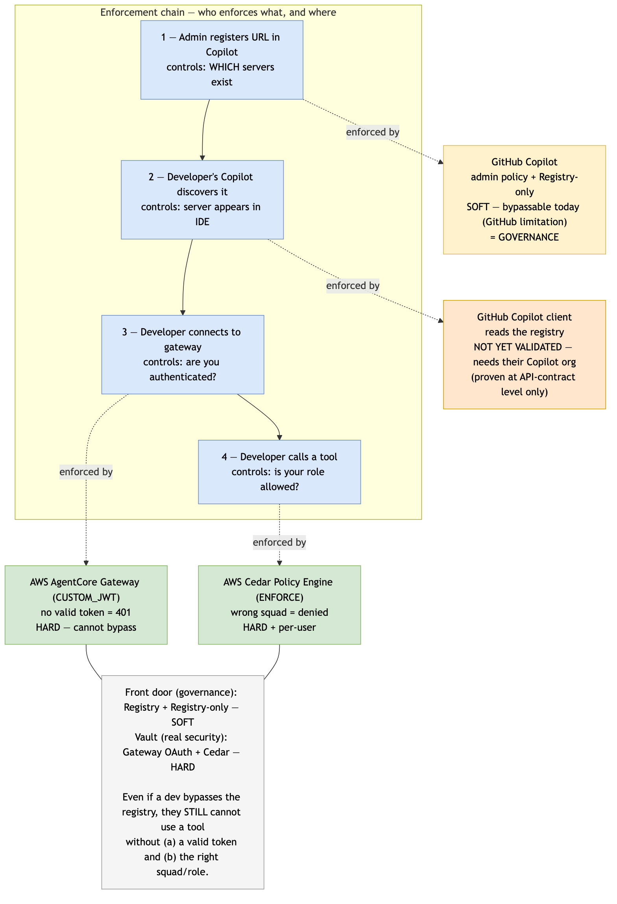
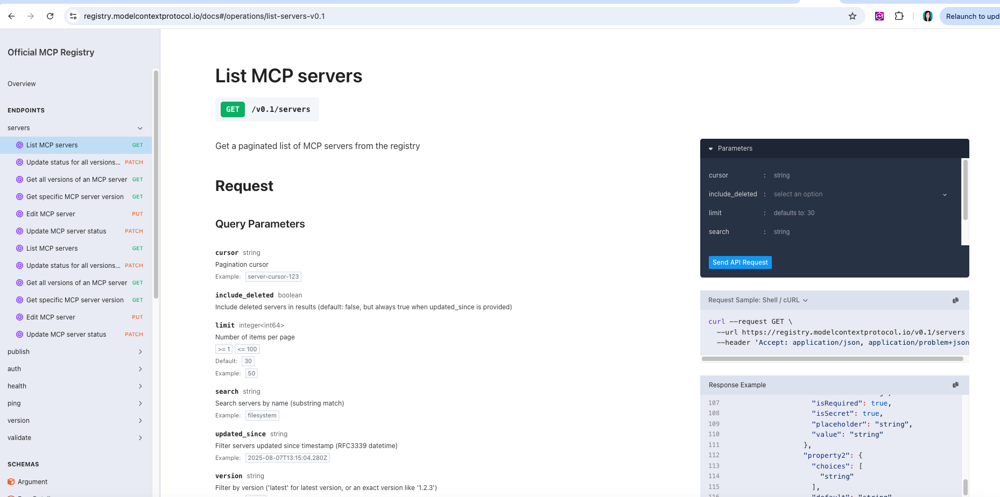
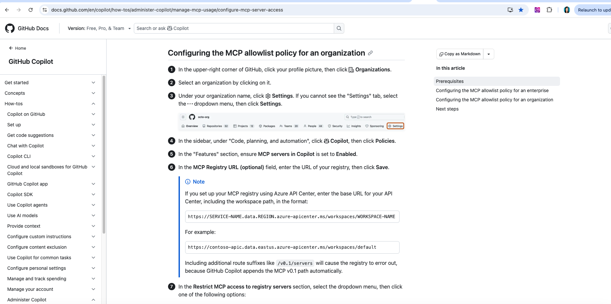
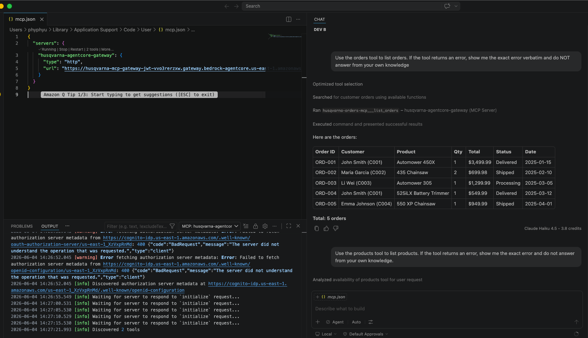
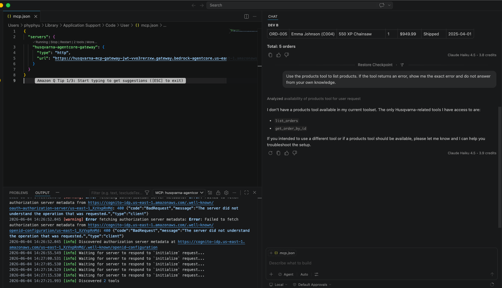

# OAuth/JWT + MCP Registry Demo (Native IDE Login, No Local Proxy)

> **Give developers a native login experience in their IDE, governed by a central registry URL and per-team Cedar RBAC — zero local install, zero IAM keys on the laptop.**

This is the **OAuth path** of the demo. Compared to the IAM/SigV4 path (which uses a local proxy + IAM user tags), this path:
- Uses **native OAuth login** in the IDE (browser popup → sign in → done)
- Serves a **MCP Registry URL** that you paste into the GitHub Copilot admin field (the exact requirement enterprise customers ask for)
- Needs **nothing installed locally** (no proxy, no credentials file — BIS-policy compliant)
- Uses **JWT claims** for Cedar RBAC (team/squad injected by Cognito pre-token Lambda)

---

## Architecture


**Flow:**
1. Admin pastes the registry URL into GitHub Copilot admin settings
2. Developers see the approved MCP servers in their IDE
3. Developer connects → native OAuth login (browser popup)
4. Every tool call is checked by Cedar at the gateway



---

## Two Layers of Enforcement



| Layer | What it controls | Strength | Where |
|-------|-----------------|----------|-------|
| Registry + "Registry only" | Which MCP servers developers can discover | Soft (bypassable today — GitHub limitation) | GitHub Copilot |
| Gateway OAuth + Cedar | Whether you can connect + which tools you can call | **Hard (cannot bypass)** | AWS AgentCore |

> Even if a developer bypasses the registry, they still cannot use any tool unless they authenticate (gateway) AND have the right team (Cedar).

---

## One-Click Deploy

```bash
./deploy.sh           # defaults to us-east-1
./deploy.sh eu-west-1 # or specify a region
```

This single command creates everything:
1. Cognito User Pool + pre-token Lambda (injects `team` claim)
2. MCP Registry Lambda + API Gateway (serves GitHub Copilot v0.1 spec)
3. Lambda MCP servers (products, orders, customers, jira)
4. AgentCore Gateway (CUSTOM_JWT auth)
5. Cedar policies (per-team RBAC)
6. Two test users (alice = Engineering, bob = Support)

**Output:**
```
╔══════════════════════════════════════════════════════════════╗
║  ✅ DEPLOYMENT COMPLETE
║  Registry URL: https://xxx.execute-api.us-east-1.amazonaws.com/prod
║  Gateway URL:  https://xxx.gateway.bedrock-agentcore.us-east-1.amazonaws.com/mcp
║  Test credentials:
║    alice@example.com / DemoPass123!  (team: Engineering)
║    bob@example.com   / DemoPass123!  (team: Support)
╚══════════════════════════════════════════════════════════════╝
```

---

## The Registry URL

The **Registry URL** is what an admin pastes into GitHub Copilot's "MCP Registry URL" field:



GitHub Copilot requires the v0.1 MCP Registry spec:



Our registry Lambda returns exactly this shape:


The registry is backed by API Gateway + Lambda. In production, you could source it from AWS Agent Registry, a database, or anything — **the contract is what matters**.

---

## RBAC Matrix

| Tool | Engineering (alice) | Support (bob) |
|------|:---:|:---:|
| products — list / search / get | ✅ ALLOW | ❌ DENY |
| orders — list / get / create | ✅ ALLOW | ❌ DENY |
| customers — list / get | ❌ DENY | ✅ ALLOW |
| jira — list tickets | ❌ DENY | ✅ ALLOW |

Cross-team denial is automatic via Cedar **default-deny** — no explicit forbid needed.

---

## Demo Walkthrough

### 1. Copy the VS Code config

After `deploy.sh` completes, copy the generated config:

```bash
cp vscode-config/mcp-oauth.json ~/Library/Application\ Support/Code/User/mcp.json
# On Linux: cp vscode-config/mcp-oauth.json ~/.config/Code/User/mcp.json
```

### 2. Start the MCP server in VS Code

1. Command Palette → **MCP: List Servers** → start `mcp-gateway`
2. Browser opens → sign in as **alice@example.com** / `DemoPass123!`
3. Tools load (no plugin, no proxy, no AWS keys on disk)

### 3. Test allowed tools (Engineering)

In Copilot Chat (Agent mode):
> "Use the products tool to list products. If the tool returns an error, show me the exact error and do not answer from your own knowledge."

✅ Returns real product data — Cedar allowed it.


### 4. Test denied tools (Engineering)

> "Use the customers tool to list customers. If the tool returns an error, show me the exact error and do not answer from your own knowledge."

❌ Denied — customers belongs to Support team.


### 5. Flip identity (Support)

Sign out, re-login as **bob@example.com**:
- Customers ✅ ALLOW
- Products ❌ DENY




**Same registry, same gateway, different identity → different permissions.**

---

## Tips & Gotchas

### VS Code OAuth redirect URIs
The CloudFormation template pre-registers the VS Code redirect URIs (`http://127.0.0.1:33418`, `vscode://...`). If you get "Client is not enabled for OAuth2.0 flows," check that the callback URLs match VS Code's actual redirects.

### The hallucination trap
When a tool is denied, Copilot may answer from training data and look like it worked. Use the exact prompt wording: *"show me the exact error and do not answer from your own knowledge."*

### Cedar single-action permits
A single permit with a long `action in [...]` list may silently fail on AgentCore. Use one permit per action — it's what this demo does.

### Token caching between users
VS Code + Cognito may cache the OAuth token/cookie. To cleanly switch users, use different VS Code profiles or clear the browser Cognito cookie.

---

## Cleanup

```bash
./cleanup.sh          # removes everything
```

---

## Customization

### Add your own tools
1. Write a Lambda function (see `lambda/mcp-servers/products-mcp/` for the pattern)
2. Add it to `deploy-oauth.sh`
3. Add a target in `scripts/create-gateway-oauth.py`
4. Add a Cedar permit in `scripts/setup-cedar-oauth.py`

### Add your own teams
1. Create Cognito users with `custom:team = YourTeam`
2. Add Cedar permits for the new team in `setup-cedar-oauth.py`

### Use your own IdP
Replace the Cognito pool with your enterprise IdP (Okta, Azure AD, etc.):
1. Update the gateway's `issuerUrl` to your IdP's OIDC issuer
2. Ensure the JWT contains a `team` (or `squad`, `group`) claim
3. Update Cedar policies to match the claim name

### Connect to AWS Agent Registry (preview)
When AWS Agent Registry GAs, your Lambda can source the catalog from it instead of a static list — one-line change, same URL for Copilot.

---

## Prerequisites

- AWS CLI configured with admin credentials
- Python 3.9+
- `jq` installed (`brew install jq` on macOS)
- AWS account with Bedrock AgentCore access

---

## Resources

- [GitHub Copilot MCP Registry docs](https://docs.github.com/en/copilot/how-tos/administer-copilot/manage-mcp-usage/configure-mcp-registry)
- [Official MCP Registry spec](https://registry.modelcontextprotocol.io/docs)
- [Cedar Policy Language](https://www.cedarpolicy.com/)
- [AWS AgentCore Gateway docs](https://docs.aws.amazon.com/bedrock-agentcore/latest/devguide/gateway.html)
- [AWS Agent Registry (preview)](https://docs.aws.amazon.com/bedrock-agentcore/latest/devguide/registry.html)
