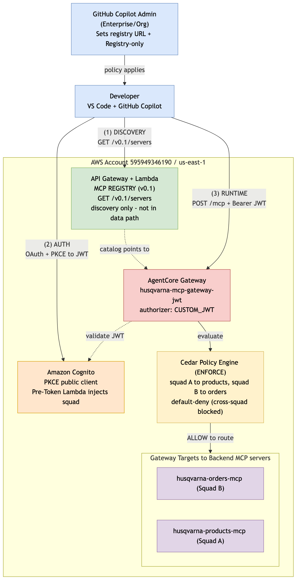
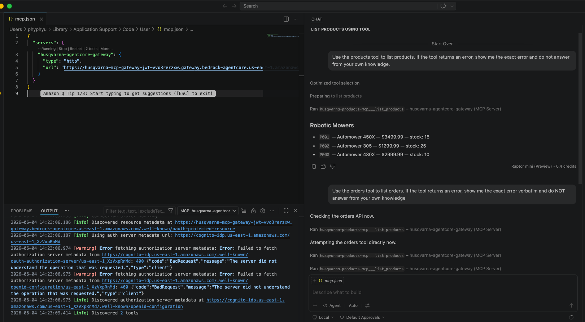
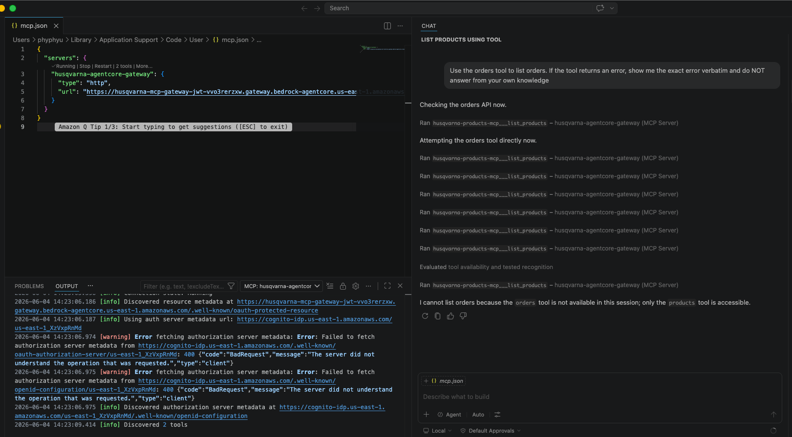
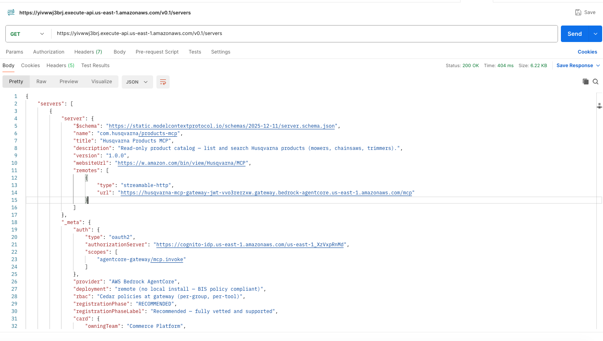

# Tool-Level RBAC for AI Coding Assistants with Amazon Bedrock AgentCore Gateway

Give every developer access to AI-powered tools through their IDE while maintaining fine-grained, per-user access control — enforced centrally with zero code changes.

## The customer problem

Organizations adopting AI coding assistants face a governance gap: existing MCP tool access is all-or-nothing. Either every developer can use every tool, or MCP is disabled entirely. Platform teams need:

- **Per-developer permissions** — junior developers read data, senior developers create/modify
- **A native registry URL** — the IDE discovers approved tools from a central catalog (no plugins, no local installs)
- **Centralized audit** — who used which tool, when, and whether it was allowed or denied
- **Zero friction for developers** — no credential files to manage, no proxies to configure

## How this solution works

Amazon Bedrock AgentCore Gateway sits between the IDE and your internal tools, evaluating Cedar policies on every tool call:

```
Developer → IDE (Copilot/Kiro/Cursor) → AgentCore Gateway → Cedar Policy → MCP Tools
                                                ↓
                                    ✅ list_customers → allowed
                                    ❌ create_order  → denied (ReadOnly group)
```

A separate MCP Registry Lambda serves the catalog in the shape GitHub Copilot expects (`GET /v0.1/servers`), so an admin registers one URL and developers discover the approved gateway automatically.



## Two authentication paths

This sample supports both IAM and OAuth authentication. Choose based on your requirements:

| | Path A: IAM/SigV4 | Path B: OAuth/JWT |
|---|---|---|
| **How developers authenticate** | AWS credentials (profiles) + local SigV4 proxy | Native browser login (OAuth popup in IDE) |
| **Identity source for Cedar** | IAM user tags (`group=ReadOnly`) | JWT claims (`team=Engineering`) |
| **Local requirements** | SigV4 proxy process | Nothing — fully remote |
| **One-click deployable** | ✅ `./deploy.sh` | Manual setup (documented) |
| **Best for** | Internal teams with AWS credentials, quick demos | Enterprise customers needing BIS-policy compliance (no local install) |

**Both paths** use the same gateway, same Cedar policies, same Lambda MCP tools. Only the authentication layer differs.

## Deploy in one command (IAM path)

```bash
git clone https://github.com/aws-samples/sample-mcp-gateway-rbac-with-bedrock-agentcore.git
cd sample-mcp-gateway-rbac-with-bedrock-agentcore/gateway-url-ide-integration-demo
./deploy.sh
```

This creates:
1. Four Lambda MCP servers (products, orders, customers, jira)
2. An MCP Registry Lambda + API Gateway (the URL for GitHub Copilot admin)
3. An AgentCore Gateway with IAM authorization
4. Cedar RBAC policies (ReadOnly vs FullAccess)
5. Two IAM test users with group tags

The script outputs the Registry URL, Gateway URL, and IAM credentials to configure as AWS profiles. No passwords are stored in the repository.

**Prerequisites:** AWS CLI (configured with admin access), Python 3.9+, jq

## Test RBAC in your IDE

After deployment:

1. Configure your AWS profile:
   ```bash
   export AWS_PROFILE=mcp-demo-readonly
   code .
   ```

2. In VS Code Copilot Chat (Agent mode):
   > "List all products"
   
   ✅ Works — ReadOnly group has `list_products` permission.

3. Then ask:
   > "Create an order for customer CUST-001"
   
   ❌ Denied — ReadOnly group cannot call `create_order`.

4. Switch to the FullAccess profile and repeat — both work.

**Same gateway, same tool, different identity → different permissions.**




## RBAC model

| Tool | ReadOnly | FullAccess |
|------|:--------:|:----------:|
| `list_customers` | ✅ | ✅ |
| `list_products` / `search_products` | ✅ | ✅ |
| `list_orders` / `get_order_by_id` | ✅ | ✅ |
| `list_jira_tickets` | ✅ | ✅ |
| `create_order` | ❌ | ✅ |

Cedar uses **default-deny**: any action without an explicit permit is blocked. Adding a new permission is one Cedar statement — no code deployment.

## The MCP Registry

The registry Lambda serves the [MCP Registry v0.1 spec](https://registry.modelcontextprotocol.io/docs) that GitHub Copilot expects:

```bash
curl https://<your-registry-url>/v0.1/servers | python3 -m json.tool
```

Each server record includes:
- Standard MCP fields (name, version, remote endpoint)
- Governance metadata: owning team, capabilities, registration phase (Recommended / Supported / Under Assessment)

The registry is API Gateway + Lambda. In production, you could source it from [AWS Agent Registry](https://docs.aws.amazon.com/bedrock-agentcore/latest/devguide/registry.html) (preview), a database, or any backend — the contract is what matters.



## OAuth/JWT path (documentation)

For customers who need native IDE login without a local proxy (e.g., BIS-policy compliance, enterprise IdP integration), see **[OAUTH_DEMO.md](OAUTH_DEMO.md)**.

This guide covers:
- Setting up Cognito (or any OIDC provider) with team claims
- Creating a CUSTOM_JWT gateway
- Registering VS Code redirect URIs
- Cedar policies using JWT claims instead of IAM tags

## Project structure

```
gateway-url-ide-integration-demo/
├── deploy.sh                    # One-command deploy (IAM path)
├── cleanup.sh                   # Tear down all resources
├── README.md                    # This file
├── OAUTH_DEMO.md                # OAuth/JWT setup guide
├── DEMO.md                      # Step-by-step demo script
├── VSCODE_SETUP.md              # VS Code configuration details
│
├── infrastructure/cloudformation/
│   └── registry-stack.yaml      # MCP Registry Lambda + API Gateway
│
├── lambda/mcp-servers/          # Lambda functions exposed as MCP tools
│   ├── ecommerce-mcp/           # list_customers, get_customer_by_id
│   ├── products-mcp/            # list_products, search_products, get_product_by_id
│   ├── orders-mcp/              # list_orders, get_order_by_id, create_order
│   └── jira-mcp/                # list_jira_tickets
│
├── scripts/
│   ├── create-gateway.py        # Creates AgentCore Gateway (IAM auth)
│   ├── create-gateway-oauth.py  # Creates Gateway (JWT auth) — for OAUTH_DEMO
│   ├── setup-cedar-iam.py       # Cedar policies (IAM group tags)
│   ├── setup-cedar-oauth.py     # Cedar policies (JWT team claims)
│   └── cleanup-gateway.py       # Deletes gateway + policy engine
│
├── DemoMcpGateway/              # AgentCore CLI config (alternative deploy)
│   ├── agentcore/               # agentcore.json gateway definition
│   ├── policies/                # Cedar policy files
│   └── tool-schemas/            # MCP tool JSON schemas
│
├── npm-package/customer-gateway-proxy/
│   └── bin/proxy.py             # Local SigV4 proxy (IAM path only)
│
├── vscode-config/               # VS Code MCP server configs
├── iam-policies/                # IAM policy documents
└── docs/images/                 # Architecture diagrams + screenshots
```

## How Cedar policies work

Cedar policies use IAM user tags (or JWT claims) to make per-user decisions:

```cedar
// ReadOnly: can list orders but not create them
permit(
    principal,
    action == AgentCore::Action::"orders-mcp___list_orders",
    resource == AgentCore::Gateway::"<GATEWAY_ARN>"
)
when {
    principal.hasTag("group") && principal.getTag("group") == "ReadOnly"
};
```

To change permissions: update a Cedar policy statement. No Lambda redeployment, no code change, no downtime.

## Key design decisions

**Why per-action permits (not a single permit with a list)?**
A single Cedar permit with a long `action in [...]` list does not evaluate reliably on AgentCore Gateway. Single-action permits work consistently. This is documented in our lessons learned.

**Why a separate registry Lambda (not just the gateway)?**
GitHub Copilot's registry URL needs a REST GET endpoint with CORS. The AgentCore Gateway speaks MCP (JSON-RPC) and requires authentication even to list tools. The registry Lambda bridges the two protocols — a thin adapter, not business logic.

**Why default-deny (no explicit forbid)?**
Cedar's default-deny means anything without a permit is automatically blocked. Explicit `forbid` statements are only needed for audit-visible overrides. For the demo, absence of a permit is sufficient and simpler to manage.

## Cleanup

```bash
./cleanup.sh
```

Removes all resources: Lambda functions, API Gateway, CloudFormation stack, AgentCore Gateway, policy engine, IAM users and role.

## Security

- No credentials or passwords are stored in this repository
- IAM access keys are generated at deploy time and printed once
- The gateway enforces authentication on every request (SigV4 or JWT)
- Cedar evaluates authorization on every tool call
- All decisions are logged to CloudWatch with the caller's identity
- The MCP Registry is read-only and unauthenticated by design (it serves the catalog — the gateway is the security boundary)

## Cost estimate

For 10 developers making 100 tool calls per day:

| Service | Monthly cost |
|---------|-------------|
| AgentCore Gateway (30K requests) | ~$5 |
| Lambda MCP servers (30K invocations) | ~$1 |
| Lambda Registry (minimal) | <$1 |
| API Gateway (minimal) | <$1 |
| CloudWatch Logs | ~$1 |
| **Total** | **~$9/month** |

## Resources

- [Amazon Bedrock AgentCore Gateway](https://docs.aws.amazon.com/bedrock-agentcore/latest/devguide/gateway.html)
- [Cedar Policy Language](https://www.cedarpolicy.com/)
- [MCP Registry v0.1 specification](https://registry.modelcontextprotocol.io/docs)
- [GitHub Copilot MCP Registry configuration](https://docs.github.com/en/copilot/how-tos/administer-copilot/manage-mcp-usage/configure-mcp-registry)
- [AWS Agent Registry (preview)](https://docs.aws.amazon.com/bedrock-agentcore/latest/devguide/registry.html)

## License

This library is licensed under the MIT-0 License. See [LICENSE](../LICENSE).
